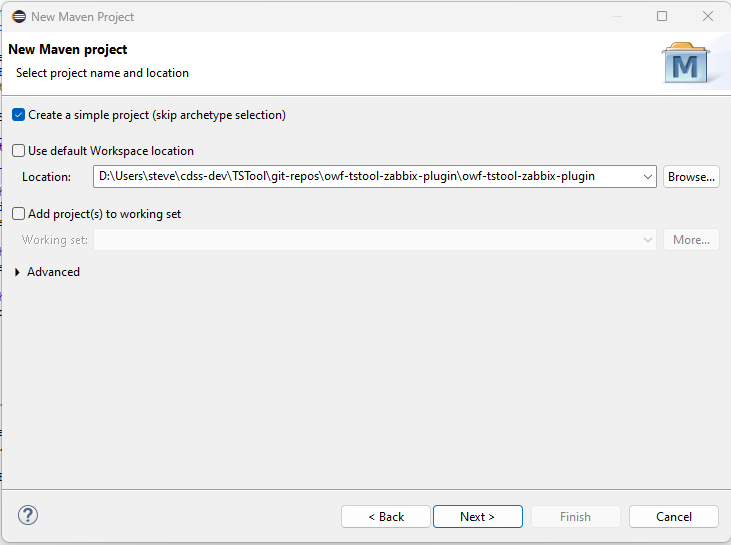
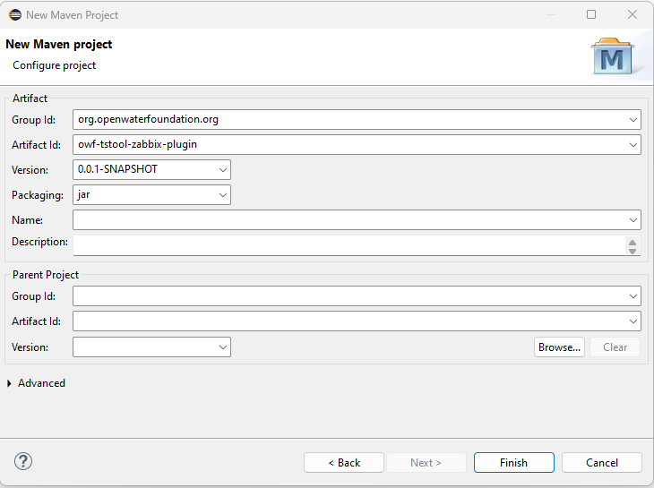

# Setting up the Zabbix Plugin in Eclipse #

These notes document how to set up the plugin as an Eclipse Maven project.
This is typically only done once when first setting up the project and repository.

## Initialize the Repository ##

Create the GitHub public repository `owf-tstool-zabbix-plugin`.

Clone to the `TSTool/git-repos` folder on the computer.

Copy the `README.md`, `.gitignore`, `.gitattributes`, and `build-util/` files
from the `tstool-aws-plugin` repository and modify.
The `README.md` and `build-util/` files will be updated as the code is updated.

## Add Maven Project to Eclipse ##

Start the TSTool Eclipse environment by running the `cdss-app-tstool-main\build-util\run-eclipse-win64.cmd` command file
from a Windows command shell.

Use the Eclipse ***File / New / Project... / Maven / Maven Project***.  Specify information as shown in the following image.
Redundant `owf-tstool-zabbix-plugin` folders are used, one for the Git repository folder working files,
and one for the Maven project with source files.
This allows other top-level folders to be created in the repository to separate major development files, including documentation and tests.

Press ***Next >***. Then fill out the new maven project artifact properties as follows:

Press ***Finish***.  The project will be created in Eclipse.
Add code to the `src/main/java` folder.

Other developers will be able to clone the repository and add as an existing Maven project.
