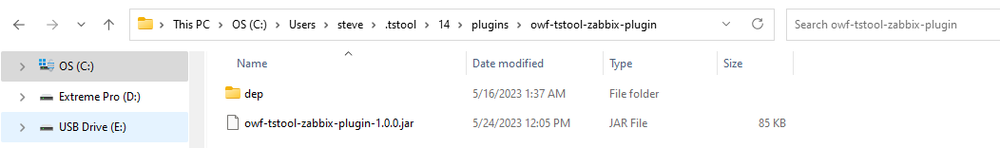

# TSTool / Install Zabbix Plugin #

This appendix describes how to install and configure the TSTool Zabbix Plugin.

*   [Install TSTool](#install-tstool)
*   [Install and Configure the TSTool Zabbix Web Services Plugin](#install-and-configure-the-tstool-zabbix-web-services-plugin)

-------

## Install TSTool ##

TSTool must be installed before installing the Zabbix plugin.
Typically the latest stable release should be used, although a development version can be installed to use new features.
Multiple versions of TSTool can be installed at the same time.

1.  Download TSTool:
    *   Download the Windows version from the
        [State of Colorado's TSTool Software Downloads](https://opencdss.state.co.us/tstool/) page.
    *   Download the Linux version from the
        [Open Water Foundation TSTool download page](https://software.openwaterfoundation.org/tstool/).
2.  Run the installer and accept defaults.
3.  Run TSTool once by using the ***Start / CDSS / TSTool-Version*** menu on Windows
    (or run the `tstool` program on Linux).
    This will automatically create folders needed to install the plugin.

## Install and Configure the TSTool Zabbix Web Services Plugin ##

This documentation describes how to install and configure the TSTool Zabbix plugin.

The folder structure on the computer should be similar to the following.
The `plugins-old` folder is an archive of old plugin versions in case versions need to be switched.

```
Windows:

       C:\Users\user\.tstool\14\
         plugins\
           owf-tstool-zabbix-plugin\
             owf-tstool-zabbix-plugin-1.1.2.jar
         plugins-old\
           owf-tstool-zabbix-plugin\
             owf-tstool-zabbix-plugin-1.1.1.jar

Linux:

       /home/user/.tstool/14/
         plugins/
           owf-tstool-zabbix-plugin-1.1.2.jar
         plugins-old/
           owf-tstool-zabbix-plugin-1.1.1.jar
```

On Windows, the installation folder in Windows Explorer will be similar to the following:

**<p style="text-align: center;">

</p>**

**<p style="text-align: center;">
Zabbix Plugins Folders on Windows (<a href="../windows-plugins.png">see full-size image)</a>
</p>**

To install or update the plugin:

1.  Download the `tstool-zabbix-plugin` software installer file from the
    [TSTool Zabbix Download page](https://software.openwaterfoundation.org/tstool-zabbix-plugin/).
    For example with a name similar to `tstool-zabbix-plugin-1.0.0-win-202305232446.zip`.
2.  If installing the plugin in user files and if TSTool was not run before,
    run TSTool once to automatically create user folders and files needed by the plugin.
3.  If an old version of the plugin was previous installed,
    delete the old `jar` file or move to the `plugins-old/` folder to archive.
    Only one copy of the plugin `jar` file can be found in the `plugins` folder to avoid software conflicts.
    If the Zabbix plugin features are not functioning properly, it may be due to conflicting jar files.
    The `plugins-old` folder is not necessary and is just a local copy of old versions to facilitate troubleshooting.
4.  Expand the zip file or navigate to the zip file in Windows Explorer.
    Copy the top-level folder in the zip file to the TSTool `plugins` folder
    as shown in the above folder structure.
5.  Configure one or more datastore configuration files according to the
    [Zabbix Data Web Services Datastore](../datastore-ref/Zabbix/Zabbix.md#datastore-configuration-file) documentation.
6.  Test web services access using TSTool by selecting the datastore name that was configured and selecting time series.
7.  If there are issues, use the ***View / Datastores*** menu item to list enabled datastores.
8.  If necessary, see the [Troubleshooting](../troubleshooting/troubleshooting.md) documentation.

TSTool will be enhanced in the future to provide a "plugin manager" to help with these tasks.
