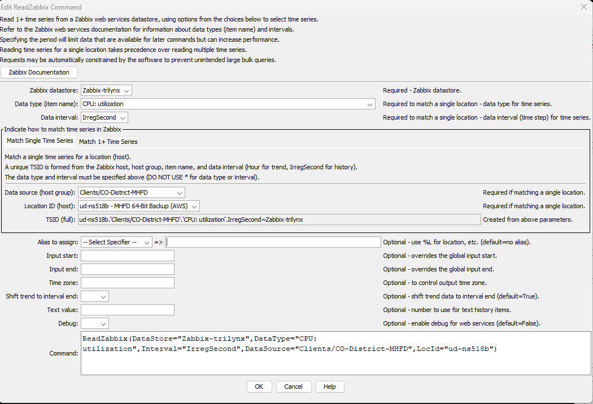
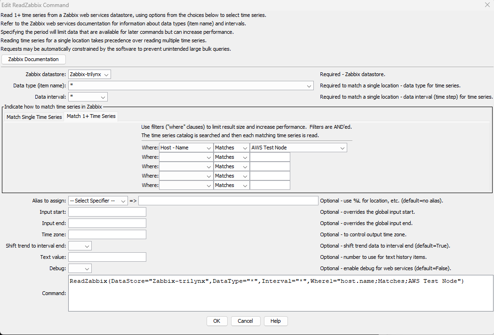

# TSTool / Command / ReadZabbix #

*   [Overview](#overview)
*   [Command Editor](#command-editor)
    +   [Match Single Time Series](#match-single-time-series)
    +   [Match 1+ Time Series](#match-1-time-series)
*   [Command Syntax](#command-syntax)
*   [Examples](#examples)
*   [Troubleshooting](#troubleshooting)
*   [See Also](#see-also)

-------------------------

## Overview ##

The `ReadZabbix` command reads one or more time series from Zabbix web services:

*   Read a single time series by matching a TSTool time series identifier (TSID).
*   Read 1+ time series using filters similar to the main TSTool window.

See the [Zabbix Data Web Services Datastore Appendix](../../datastore-ref/Zabbix/Zabbix.md)
for more information about Zabbix web service integration and limitations.
The command is designed to utilize web service query criteria to process large numbers of time series,
for example to produce real-time information products and perform historical data analysis and quality control.

See also the 
[TSID for Zabbix](../TSID/TSID.md) time series identifier command,
which reads time series for a single time series.

The ***Data type***, ***Data interval***, and ***Where*** command parameters and input fields
are similar to those in the main TSTool interface.
However, whereas the main TSTool interface first requires a query to find the
matching time series list and interactive select to copy specific time series identifiers into the ***Commands*** area,
the `ReadZabbix` command automates reading the time series list and the corresponding data for the time series.
Using the `ReadZabbix` command can greatly shorten command files and simplify command logic
when processing many time series.
However, because the command can process many time series and web services are impacted by network speed,
running the command can take a while to complete.

Data for the location and other time series metadata,
as shown in the main TSTool interface, are set as time series properties, using web service data values.
Right-click on a time series in the TSTool ***Results*** area and then use the
***Time Series Properties*** menu to view time series properties.
These properties can be transferred to a table with the
[`CopyTimeSeriesPropertiesToTable`](https://opencdss.state.co.us/tstool/latest/doc-user/command-ref/CopyTimeSeriesPropertiesToTable/CopyTimeSeriesPropertiesToTable/)
command and processed further with other table commands.

The TSTool Zabbix plugin automatically manipulates time series timestamps to be consistent
with TSTool, as follows:

+   History data:
    *   Time series has data interval `IrregSecond`.
    *   The timestamp (Zabbix `clock`) indicates the time of the observation or computed value.
    *   No adjustment to the timestamp is required.
+   Trend data:
    *   Time series has data interval `Hour`.
    *   Zabbix uses a timestamp (`clock`) corresponding to the interval start.
        However, TSTool uses timestamps correspondoing to the interval end.
        Therefore, by default, trend data timestamps will be shifted to the interval end
        to ensure that data align with other TSTool data.
        This may result in trend values that are slightly inaccurate because
        interval-ending history values will be included in neighboring hourly values.
        Use the [`ReadZabbix`](../../command-ref/ReadZabbix/ReadZabbix.md) command to control
        Handling of the timestamp.
        
## Command Editor ##

The following dialog is used to edit the command and illustrates the syntax for the command.
Two options are available for matching time series.

### Match Single Time Series ###

The following example illustrates how to read a single time series by specifying the data type and interval (top)
and location identifier and time series short name (***Match Single Time Series*** tab).
This approach is similar to using the general
[`ReadTimeSeries`](https://opencdss.state.co.us/tstool/latest/doc-user/command-ref/ReadTimeSeries/ReadTimeSeries/)
command but offers parameters specific to Zabbix web services.

**<p style="text-align: center;">

</p>**

**<p style="text-align: center;">
`ReadZabbix` Command Editor to Read a Single Time Series (<a href="../ReadZabbix-single.png">see full-size image)</a>
</p>**

### Match 1+ Time Series ###

The following figure illustrates how to query multiple time series.
For example, this can be used to process all time series of a data type in the system
or all time series for a host.

**<p style="text-align: center;">

</p>**

**<p style="text-align: center;">
`ReadZabbix` Command Editor to Read Multiple Time Series (<a href="../ReadZabbix-multiple.png">see full-size image)</a>
</p>**

## Command Syntax ##

The command syntax is as follows:

```text
ReadZabbix(Parameter="Value",...)
```

**<p style="text-align: center;">
Command Parameters
</p>**

|**Tab**|**Parameter**&nbsp;&nbsp;&nbsp;&nbsp;&nbsp;&nbsp;&nbsp;&nbsp;&nbsp;&nbsp;&nbsp;&nbsp;&nbsp;&nbsp;&nbsp;&nbsp;&nbsp;&nbsp;|**Description**|**Default**&nbsp;&nbsp;&nbsp;&nbsp;&nbsp;&nbsp;&nbsp;&nbsp;&nbsp;&nbsp;&nbsp;&nbsp;&nbsp;&nbsp;&nbsp;&nbsp;&nbsp;&nbsp;&nbsp;&nbsp;&nbsp;&nbsp;&nbsp;&nbsp;&nbsp;&nbsp;&nbsp;|
|--------------|-----------------|-----------------|--|
|All|`DataStore`<br>**required**|The Zabbix datastore name to use for the web services connection, as per datastore configuration files (see the [Zabbix Web Services Datastore appendix](../../datastore-ref/Zabbix/Zabbix.md)). | None - must be specified. |
||`DataType`<br>**required**|The data type to be queried:<ul><li>`item.name` - for history data</li><li>`item.name` appended with the statistic (e.g., `-Avg`) - for trend data</li></ul> Surround with single quotes if the value contains a space or period. | `*` to read all the time series. |
||`Interval`<br>**required**|The data interval for the time series<ul><li>`IrregSecond` - for history data</li><li>`Hour` - for trend data</li></ul> | `*` - to read all the time series. |
|***Match Single Time Series***|`DataSource`<br>**required**|The data source, corresponding to Zabbix `hostgroup.name`. Surround with single quotes if the value contains a space or period. | None - must be specified to read a single time series. |
||`LocId`<br>**required**|The location identifier, corresponding to Zabbix `host`. Surround with single quotes if the value contains a space or period. | None - must be specified to read a single time series. |
||`TSID`| A view-only value that indicates the time series identifier that will result from the input parameters when a single time series is queried. | |
|***Match 1+ Time Series***|`WhereN`|When reading 1+ time series, the “where” clauses to be applied.  The filters match the values in the Where fields in the command editor dialog and the TSTool main interface.  The parameters should be named `Where1`, `Where2`, etc., with a gap resulting in the remaining items being ignored.  The format of each value is:<br>`Item;Operator;Value`<br>Where `Item` indicates a data field to be filtered on, `Operator` is the type of constraint, and `Value` is the value to be checked when querying.|If not specified, the query will not be limited and very large numbers of time series may be queried.|
|All|`Alias`<br>|The alias to assign to the time series, as a literal string or using the special formatting characters listed by the command editor.  The alias is a short identifier used by other commands to locate time series for processing, as an alternative to the time series identifier (`TSID`).|None – alias not assigned.|
||`InputStart`|Start of the period to query, specified as a date/time with a precision that matches the requested data interval. The time is in the time zone for the host, or GMT if the host does not have a time zone. |Read all available data.|
||`InputEnd`|End of the period to query, specified as a date/time with a precision that matches the requested data interval. The time is in the time zone for the host, or GMT if the host does not have a time zone. |Read all available data.|
||`TimeZone`| Time zone for output, used when the web services time zone is not the same as that of the host. | Output will use the web service data time zone (GMT). |
||`ShiftTrendToIntervaEnd`| Zabbix uses a timestamp at the interval start.  TSTool uses a timestamp at the interval end.  This parameter controls how the timestamp is handled for hourly trend data:<ul><li>`False` - trend timestamps are at the beginning of intervals</li><li>`True` - trend timestamps are at the end of interval</li></ul> | `True` (shift to interval end). |
||`Debug`| Used for troubleshooting:  `False` or `True`. | `False` |

## Examples ##

See the [automated tests](https://github.com/OpenWaterFoundation/owf-tstool-zabbix-plugin/tree/master/test/commands/ReadZabbix/).

## Troubleshooting ##

Refer to the TSTool log file.  Use the
[`SetDebugLevel`](https://opencdss.state.co.us/tstool/latest/doc-user/command-ref/SetDebugLevel/SetDebugLevel/) command
to increase the amount of output for debugging.

The log file typically shows the request data.
If necessary, use the [`WebGet`](https://opencdss.state.co.us/tstool/latest/doc-user/command-ref/WebGet/WebGet/) command
to manually test the request (see [examples](https://github.com/OpenWaterFoundation/owf-tstool-zabbix-plugin/tree/main/test/commands/WebGet)).

Confirm that the TSTool Zabbix plugin is implemented for the Zabbix API version.

## See Also ##

*   [`CopyTimeSeriesPropertiesToTable`](https://opencdss.state.co.us/tstool/latest/doc-user/command-ref/CopyTimeSeriesPropertiesToTable/CopyTimeSeriesPropertiesToTable/) command
*   [`ReadTimeSeries`](https://opencdss.state.co.us/tstool/latest/doc-user/command-ref/ReadTimeSeries/ReadTimeSeries/) command
*   [TSID for Zabbix](../TSID/TSID.md) command
*   [`WebGet`](https://opencdss.state.co.us/tstool/latest/doc-user/command-ref/WebGet/WebGet/) command
