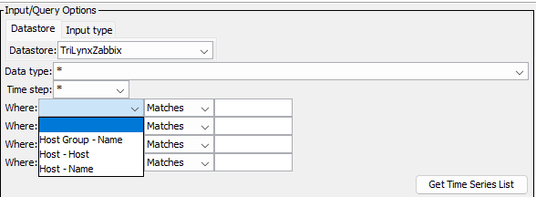

# TSTool / Datastore Reference / Zabbix Web Services #

*   [Overview](#overview)
*   [Standard Time Series Properties](#standard-time-series-properties)
*   [Other Specifications and Integration Considerations](#other-specifications-and-integration-considerations)
*   [Limitations](#limitations)
*   [Datastore Configuration File](#datastore-configuration-file)
*   [See Also](#see-also)

--------------------

## Overview ##

The Zabbix web services allow Zabbix data to be queried by software,
including web applications and analysis tools such as TSTool.
TSTool accesses Zabbix web services using the Zabbix plugin.
See the following documentation:

*   [Install Zabbix Plugin appendix](../../appendix-install/install.md)
*   [Zabbix TSID command](../../command-ref/TSID/TSID.md)
*   [`ReadZabbix` command](../../command-ref/ReadZabbix/ReadZabbix.md)

See the Zabbix documentation for information about available web services, including web service endpoints and parameters:

*  [Zabbix current API documentation](https://www.zabbix.com/documentation/current/en/manual/api)
*  [Zabbix 5.4 API documentation](https://www.zabbix.com/documentation/5.4/en/manual/api)

TSTool primarily uses the Zabbix `item.get` service to list time series and retrieve time series metadata,
and the `history.get` and `trend.get` services to retrieve time series for display and analysis.

The TSTool [`WebGet`](https://opencdss.state.co.us/tstool/latest/doc-user/command-ref/WebGet/WebGet/)
command can be used to retrieve data from any Zabbix web service and save to a file.
For example, a JSON format file can be saved and the resulting file can be read using the
[`NewObject`](https://opencdss.state.co.us/tstool/latest/doc-user/command-ref/NewObject/NewObject/)
and
[`ReadTableFromJSON`](https://opencdss.state.co.us/tstool/latest/doc-user/command-ref/ReadTableFromJSON/ReadTableFromJSON/) commands.
These general commands provide flexibility to retrieve data in addition to the specific Zabbix datastore commands.

## Web Service to Time Series Mapping ##

Time series data objects in TSTool consist of various properties such as location identifier, data type, units,
and data arrays containing data values and flags.
To convert Zabbix data to time series requires joining Zabbix host group, host, and item for metadata,
and history and trend time series values for data.

The TSTool main interface browsing tool displays joined information in the time series list,
which is used to select time series.
The ***Data type*** (Zabbix item name) and ***Time step*** are general filters implemented for all datastores and the
***Where*** input filters are specific to Zabbix.

**<p style="text-align: center;">

</p>**

**<p style="text-align: center;">
TSTool Where Filters
</p>**

## Standard Time Series Properties ##

The general form of time series identifier used by TSTool is:

```
LocationID.DataSource.DataType.Interval~DatastoreName
```

The standard time series identifier format for Zabbix web service time series is as follows.
Single quotes are used around a time series part if the part includes a space or period character.

```
Host.HostGroupName.ItemName.Interval~DataStoreName
Host.'HostGroupName'.'ItemName'.Interval~DataStoreName
```

The meaning of the TSID parts is as follows:

*   The `LocationId` is set to:
    +   The Zabbix host, which is typically the machine name or IP address.
*   The `DataSource` is set to:
    +   The Zabbix host group name.
    +   If multiple systems are monitored,
        the host group typically corresponds to the system.
*   The `DataType` is set to:
    +   For Zabbix history data, the data type is the item name.
    +   For Zabbix trend data, the data type is the item name appended with one of the following statistics:
        -   `-Avg` for hourly average value
        -   `-Min` for hourly minimum value
        -   `-Max` for hourly maximum value
        -   Note that Zabbix trend values use a time stamp for the hour start.
            However, TSTool uses interval-end timestamps.
            Therefore, the TSTool Zabbix plugin will by default shift hourly trend values
            to use the interval-ending time.
            Use the [`ReadZabbix`](../../command-ref/ReadZabbix/ReadZabbix.md) command to control
            how the timestamp is handled.
*   The `Interval` is set to:
    +   `IrregSecond` for Zabbix history values.
    +   `Hour` for Zabbix trend values.
*   The `DatastoreName` is taken from the datastore configuration file `Name` property:
    +   The datastore name is listed in the TSTool main interface.
    +   Multiple datastores can be configured, each pointing to a different Zabbix web service.
        Therefore, datastore names should be assigned with enough detail to avoid confusion.
        The following are typical examples:
        -   `Zabbix` - general datastore name but is ambiguous if more than one Zabbix system is accessed at the same time
        -   `Zabbix-organization` - example of Zabbix web services for an organization

Important standard time series properties include:

1.  **Time Series Description**:
    1.  The Zabbix `host.name` is used for the time series description, which is used in graph legends.
2.  **Data Units**:
    1.  The Zabbix `item.units` is used for time series data units.
3.  **Missing Data Value**:
    1.  The special value `NaN` is used internally for the missing data value.
        This mainly impacts regular interval time series where
        data gaps are represented by the missing data value.

See the next section for additional mapping of Zabbix data to TSTool time series.

## Other Specifications and Integration Considerations ##

The following are other specifications related to TSTool plugin integration with Zabbix web services.

1.  **Service URL**:
    1.  The Zabbix datastore configuration file `ServiceRootURI` property is the main API address.
        However, the API is controlled by passing a JSON payload and
        therefore a request cannot be tested by only using a URL in a web browser.
        See the [Datastore Configuration File](#datastore-configuration-file) section for an example.
2. **Authentication**:
    1.  The TSTool Zabbix plugin has been tested with the `auth` JSON parameter and Zabbix version 5.4.
    2.  Preliminary support for using the API token has been added but has not been tested.
3. **Data Caching:**
    1.  TSTool performance, in particular interactive features, is impacted by web service query times.
        The number of time series is also well known.
        Therefore, the list of time series (time series catalog)
        and other data are cached to improve performance.
    2.  Additional software changes may be implemented to optimize performance and
        will utlize caching as appropriate.
    3.  If necessary, restart TSTool to use the latest Zabbix data,
        such as if new hosts and items been added that are not reflected in the TSTool user interface choices.
    4.  Zabbix itself may implement data caching to improve performance.
4.  **Response Limits (Data Throttling)**:
    1.  Zabbix history time series use a short period and all data are returned by default.
    2.  Zabbix trend time series also use a short period and all data are returned by default.
        A shorter default period may be implemented in the future for Zabbix databases that store long periods.
5.  **History Value Type**:
    1.  Zabbix history data may use floating point, integer, or text values.
    2.  Numerical values are stored in time series values.
    3.  Text values are stored in time series flags. **Not yet implemented.**
6.  **Time zone:**
    1.  Zabbix internally stores data in GMT and the web service API also uses GMT.
    2.  The plugin defaults to using host time zone time for command parameters and output.
    2.  The time zone (e.g., `America/Denver`) can be specified in the `host` description using syntax `// TimeZone=America/Denver`,
        and if detected, will result in output using the specified time zone.
        If not specified, the time zone defaults to GMT.
7.  **Timestamp and Data Interval:**
    1.  History data:
        *   Time series has data interval `IrregSecond`.
        *   The timestamp (Zabbix `clock`) indicates the time of the observation or computed value.
        *   No adjustment to the timestamp is required.
    2.  Trend data:
        *   Time series has data interval `Hour`.
        *   Zabbix uses a timestamp (`clock`) corresponding to the interval start.
            However, TSTool uses timestamps correspondoing to the interval end.
            Therefore, by default, trend data timestamps will be shifted to the interval end
            to ensure that data align with other TSTool data.
            This may result in trend values that are slightly inaccurate because
            interval-ending history values will be included in neighboring hourly values.
            Use the [`ReadZabbix`](../../command-ref/ReadZabbix/ReadZabbix.md) command to control
            Handling of the timestamp.

## Limitations ##

The following limitations and design issues have been identified during development of the Zabbix plugin.
Additional software development is required to overcome these limitations.

1.  **Web service version:**
    1.  The web service version is determined from the `apinfo.version` service.
    2.  The plugin has been tested with API version 5.4,
        which uses the older `auth` query parameter for authentication.
2.  **Text time series values:**
    1.  Currently, history time series values that are of text type are listed
        in the time series catalog but the values are not handled.
3.  **Problem time series:**
    1.  Zabbix problem data could be read as time series,
        for example to annotate time series.
        However, this feature is not yet implemented.
4.  **Event time series:**
    1.  Zabbix event data could be read as time series,
        for example to annotate time series.
        However, this feature is not yet implemented.
5.  **Template for item:**
    1.  Currently, the template associated with an item is not included in time series properties.
        This may be added in the future because it is useful to know what template
        caused an item to be measured.
        The Zabbix data model for templates is not yet fully handled.

## Datastore Configuration File ##

A datastore is configured by creating a datastore configuration file.

Create a user datastore configuration file `.tstool/NN/datastores/Zabbix-organization.cfg` (or similar) in the user's files,
for example by copying and modifying the following example, or copying from another installation.
The `NN` should agree with the major TSTool version, for example `14` as shown by the ***Help / About TSTool*** menu.
TSTool will attempt to open datastores for all enabled configuration files.

The following illustrates the `ZabbixDataStore` datastore configuration file format
and configures a datastore named `Zabbix-trilynx`.
The `Name` property is the datastore name that will be used by the TSTool - the file name can be any name
but is often the same as the `Name` with extension `.cfg`.

```
# Configuration information for the TriLynx Zabbix web service datastore.
# Properties are:
#
# Enabled - indicates if the datastore is enabled (active)
# ServiceApiDocumentationURI - URI for online API documentation
# Type - must be ZabbixDataStore to find proper software
#
# The user will see the following when interacting with the data store:
#
# Name - data store identifier used in applications, for example as the
#     input type information for time series identifiers (usually a short string)
# Description - data store description for reports and user interfaces (short phrase)
# ServiceRootURI - web service root URI, including the server name and root path

Enabled = True
#Enabled = False
Type = "ZabbixDataStore"
Name = "Zabbix-organization"
Description = "Zabbix web services"
ServiceRootURI = "https://zabbix-server.somecompany.com/zabbix/api_jsonrpc.php"
ServiceApiDocumentationURI = "https://www.zabbix.com/documentation/current/en/manual/api"
# Use this for Zabbix < 6.0:
SystemLogin = "someuser"
SystemPassword = "somepassword"
# Use this for Zabbix >= 6.0:
ApiToken = "SomeApiToken"
```

**<p style="text-align: center;">
Zabbix Web Services DataStore Configuration File
</p>**

The following table describes configuration file properties.
Contact the Zabbix system administrator to obtain configuration information for the specific system,
or see Zabbix information for a user.

**<p style="text-align: center;">
Zabbix Web Services DataStore Configuration File Properties
</p>**

| **Property**&nbsp;&nbsp;&nbsp;&nbsp;&nbsp;&nbsp;&nbsp;&nbsp;&nbsp;&nbsp;&nbsp;&nbsp;&nbsp;&nbsp;&nbsp;&nbsp;&nbsp;&nbsp;&nbsp;&nbsp;&nbsp;&nbsp;&nbsp;&nbsp;&nbsp;&nbsp;&nbsp;&nbsp;&nbsp;&nbsp;&nbsp;&nbsp;&nbsp;&nbsp;&nbsp;&nbsp;&nbsp;&nbsp;&nbsp;&nbsp; | **Description** | **Default** |
| -- | -- | -- |
| `ApiToken` | Used if the Zabbix user API token approach is used for authentication.  This approach is implemented but has not been tested. | Will be required in the future. |
| `Description`<br>**required** | Description of the datastore, typically a short sentence, used in some displays. | None - must be specified. |
| `Enabled` | Indicates whether the datastore is enabled. | `True` |
| `Name`<br>**required** | Datastore name that is used in the TSTool software and Zabbix commands.  The name should be unique across all datastores. | None - must be specified. |
| `ServiceApiDocumentationURI` | The URL for the web services API documentation, which should agree with the Zabbix version.  | If not configured, documentation will not be available from command editors. |
| `ServiceRootURI`<br>**required** | The root URL for the web services.  This should include everything ending with `api_jsonrpc.php`. | None - must be specified. |
| `SystemLogin`<br>**required** | Login name for authentication, used with older `auth` parameter authentication. | None - must be specified. |
| `SystemPassword`<br>**required** | Password for authentication, used with older `auth` parameter authentication. | None - must be specified. |
| `Type`<br>**required** | Must be `ZabbixDataStore`, which is used by TSTool to identify which plugin software to use for the datastore. | None - must be specified. |

## See Also 

*   [Zabbix TSID](../../command-ref/TSID/TSID.md) command
*   [`ReadDelimitedFile`](https://opencdss.state.co.us/tstool/latest/doc-user/command-ref/ReadDelimitedFile/ReadDelimitedFile/) command
*   [`ReadTableFromDelimitedFile`](https://opencdss.state.co.us/tstool/latest/doc-user/command-ref/ReadTableFromDelimitedFile/ReadTableFromDelimitedFile/) command
*   [`ReadTableFromJSON`](https://opencdss.state.co.us/tstool/latest/doc-user/command-ref/ReadTableFromJSON/ReadTableFromJSON/) command
*   [`ReadZabbix`](../../command-ref/ReadZabbix/ReadZabbix.md) command
*   [`WebGet`](https://opencdss.state.co.us/tstool/latest/doc-user/command-ref/WebGet/WebGet/) command
