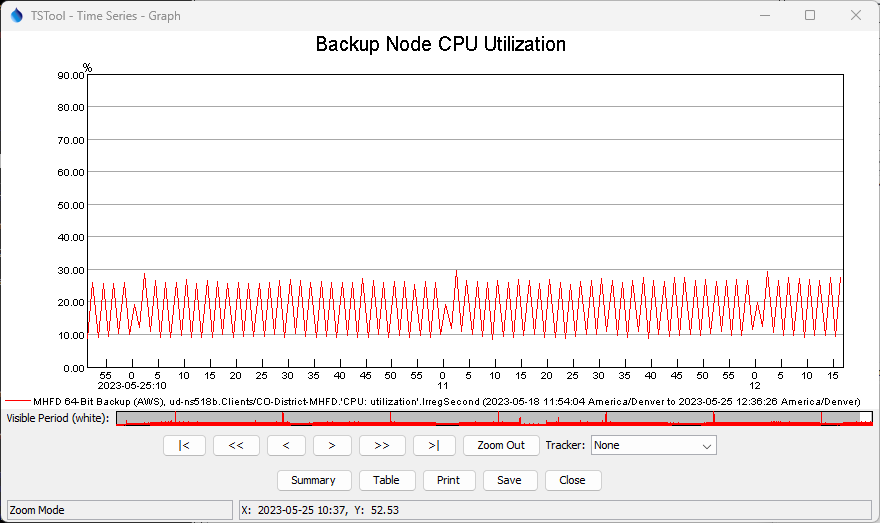

# TSTool Zabbix Plugin / Introduction #

*   [Introduction](#introduction)
*   [TSTool use with Zabbix Web Services](#tstool-use-with-zabbix-web-services)

----------------------

## Introduction ##

TSTool is a powerful software tool that automates time series processing and product generation.
It was originally developed for the State of Colorado to process data for basin modeling and has since
been enhanced to work with many data sources including:

*   United States Geological Survey (USGS) web service and file formats
*   Natural Resources Conservation Service (NRCS) web services
*   Regional Climate Center (RCC) Applied Climate Information Service (ACIS) web services
*   US Army Corps of Engineers DSS data files
*   others

TSTool is maintained by the Open Water Foundation,
which also enhances the software based on project needs.

*   See the latest [TSTool Documentation](https://opencdss.state.co.us/tstool/latest/doc-user/) to learn about core TSTool features.
*   See the [TSTool Download website](https://opencdss.state.co.us/tstool/) for the most recent software versions and documentation.
*   See the [Zabbix Plugin download page](https://software.openwaterfoundation.org/tstool-zabbix-plugin/).

## TSTool use with Zabbix Web Services ##

Zabbix Web Services provide access to data that are maintained in a [Zabbix system](https://www.zabbix.com).
Zabbix monitors software servers, for example tracking CPU and memory utilization.
See the following resources:

*   [Zabbix Current Web Service Documentation](https://www.zabbix.com/documentation/current/en/manual/api/reference/)
*   [Zabbix 5.4 Web Service Documentation](https://www.zabbix.com/documentation/5.4/en/manual/api/reference/)

The [Zabbix datastore documentation](../datastore-ref/Zabbix/Zabbix.md) describes how TSTool integrates with Zabbix.

The [`ReadZabbix`](../command-ref/ReadZabbix/ReadZabbix.md) command can be used to read time series,
in addition to time series identifiers that are generated from the main TSTool interface.

See the following examples showing how to query and visualize CPU utilization data for a server.

**

**

**

TSTool Main Interface (<a href="../TSTool-main.png">see full-size image)</a>

**

**

**

**

TSTool Graph (<a href="../TSTool-graph.png">see full-size image)</a>

**
